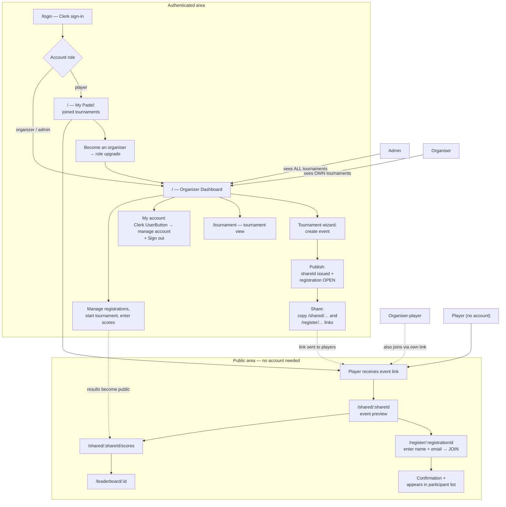
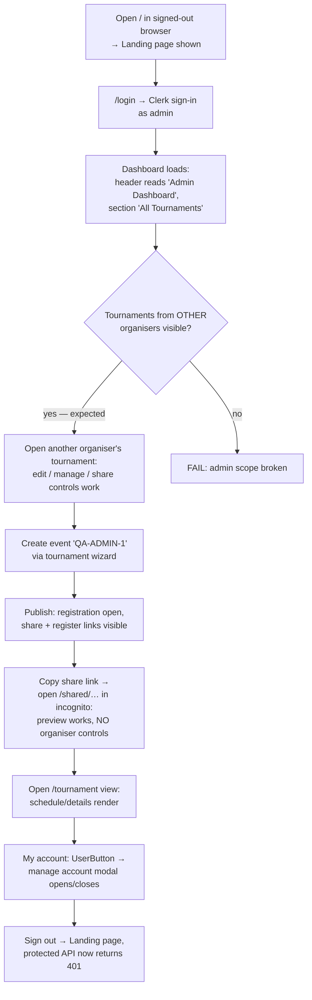
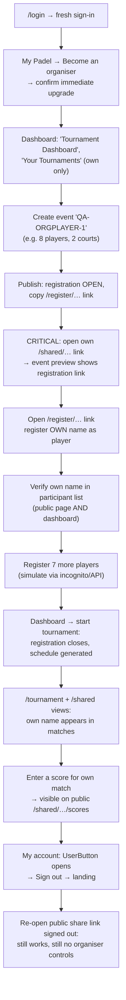
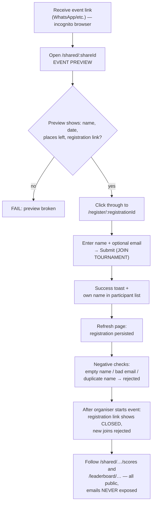
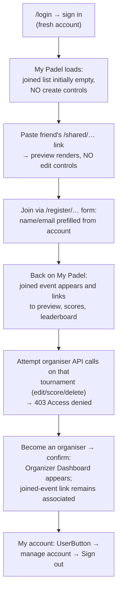
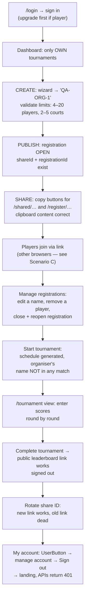
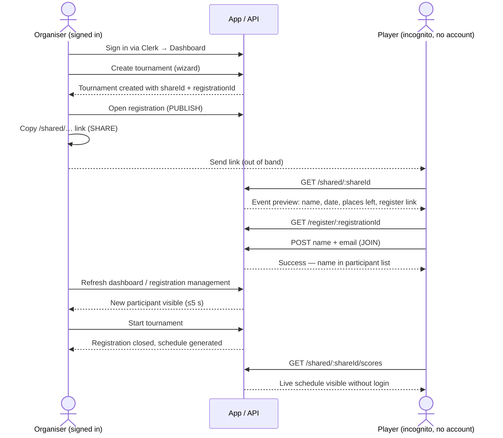

# User Flow Test Scenarios

Persona-based end-to-end test scenarios for the Padel App. Complements `release-test-plan.md` (which is feature-based); this document is **journey-based** — each scenario walks one persona through the full app.

---

## 1. How the app actually models the personas

The four personas now map to explicit app roles and journeys:

| Requested persona | Reality in the code |
|---|---|
| Admin | `users.role = 'admin'`. Dashboard shows **all** tournaments ("Admin Dashboard" / "All Tournaments"). |
| Organiser who also plays | Starts as `player`, uses **Become an organiser**, then registers themselves through their own public registration link. The account keeps its linked player registrations after the upgrade. |
| Player who is not an organiser | `users.role = 'player'` (the default for every new sign-up). Sees **My Padel**, their linked joined tournaments, and no creation controls. Anonymous joining remains supported. |
| Organiser who is not playing | `users.role = 'organizer'`, never registers themselves as a participant. |

Two further mapping notes for the required checkpoints:

- **"My account"** = the Clerk `UserButton` (avatar) in the dashboard header → "Manage account" modal, plus the explicit **Sign out** button. There is no dedicated `/account` page.
- **"Publish"** = the tournament is created with a `shareId` (public link exists immediately) **and** registration is set to `open`. There is no separate draft→published transition. Sharing = copying the two links: `/shared/{urlSlug|shareId}` (event preview) and `/register/{registrationId}` (join).

### Route map used by all scenarios

| Route | Auth required | Purpose |
|---|---|---|
| `/` | no | Landing (signed out) / My Padel (player) / Dashboard (organizer or admin) |
| `/login` | no | Clerk sign-in |
| `/tournament` | yes | Tournament view (organizer) |
| `/shared/:shareId` | no | Public event preview (also shows the join link) |
| `/shared/:shareId/scores` | no | Public live scores |
| `/register/:registrationId` | no | Public join ("enter the tournament") |
| `/leaderboard/:leaderboardId` | no | Public final standings |

---

## 2. Master flow — how all personas relate

---

## 3. Scenario A — Admin

**Account:** Clerk user with `role = 'admin'` in the DB (set manually; there is no in-app promotion flow).
**Goal:** verify the admin sees and can manage *everything*, plus completes the full create→publish→share critical flow.

**Steps and expected results**

| # | Action | Expected |
|---|---|---|
| A1 | Visit `/` signed out | Landing page, no dashboard data leaks |
| A2 | Sign in via Clerk as admin | Redirect to dashboard |
| A3 | Inspect dashboard header | "Admin Dashboard", "All Tournaments" — tournaments owned by other users listed |
| A5 | Edit / share another organiser's tournament | Allowed (admin override) — verify API does not return 403 |
| A6–A7 | Create + publish `QA-ADMIN-1` | Share link `/shared/…` and registration link `/register/…` shown |
| A8 | Open share link in incognito | Public preview renders; no edit/delete/score controls |
| A9 | Visit `/tournament` | Renders while authenticated |
| A10 | UserButton → manage account | Clerk profile modal opens; email/profile correct |
| A11 | Sign out | Back to landing; repeat one mutating API call → `401` |

---

## 4. Scenario B — Organiser who is also a player

**Account:** fresh Clerk sign-up (defaults to `role = 'player'`), upgraded through **Become an organiser**.
**Goal:** the full lifecycle from one person's perspective: create → publish → share → **join own event as a player** → run and score the tournament including themselves.

**Key assertions unique to this persona**

- The organiser's self-registration goes through the **same public form** as everyone else — the name appears in the participant list within 5 seconds on both the public page and the dashboard.
- Duplicate protection: trying to register the same name twice (different capitalisation) is rejected.
- After starting the tournament, the organiser-player appears in the generated schedule like any player (American format pairing rules hold).
- The organiser can enter scores for matches **they play in** — no self-conflict restriction exists, verify it saves normally.
- After sign-out, the public links (`/shared`, `/scores`) still resolve — playing does not depend on the session.

---

## 5. Scenario C — Player who is not an organiser

Two variants — both must pass. **Variant C1 (anonymous) is the critical one**, since this is how real players join.

### C1 — Anonymous player (no account) — CRITICAL FLOW

**Assertions**

- No step ever redirects to `/login` — the entire join journey is account-free.
- The participant list on public pages never exposes other players' **email addresses**.
- Joining when the event is `full` or `closed` is rejected with a clear message.
- Concurrency: two browsers submitting the last free place nearly simultaneously → capacity never exceeded (mirrors P4 in the release plan).

### C2 — Signed-in player account

Sign in as a fresh Clerk user who has never created anything, then run the linked-account player journey.

The important design insight: **being signed in must give a player zero extra power** over someone else's event. D6 is the security assertion (ownership isolation, mirrors A4 in the release plan). The upgrade only grants creation capability and never grants ownership of events created by someone else.

---

## 6. Scenario D — Organiser who is not playing

**Account:** established `role = 'organizer'`, or a new player account upgraded through **Become an organiser** before E2.
**Goal:** the pure event-management lifecycle — the most complete pass through the CRITICAL create→publish→share flow.

**Key assertions unique to this persona**

- The organiser never appears in the participant list or schedule — verify a 8-player event with 8 *other* registrants generates a schedule not containing the organiser.
- Share-link rotation (P1 in release plan): only the owner can rotate; old `shareId` returns not-found afterwards.
- Deleting/cancelling: cancel `QA-ORG-1` → status badge updates; public link reflects cancelled state.

---

## 7. Critical flow — end-to-end sequence (organiser × player)

The single most important test in the suite. Run it as one continuous session with two browser contexts:

**Pass criteria:** every arrow succeeds without console errors or failed network requests; the player side never sees a login wall; the organiser side sees the join reflected without manual cache-clearing.

---

## 8. Active suggestions for designing the best test scenarios

### Gaps found in the app that the tests should force decisions on

1. **Account linking has two paths.** Signed-in joins are linked by Clerk `userId`; older or anonymous joins are recovered by a case-insensitive account-email match. Test both paths, and verify registrations marked `removed` never appear in My Padel.
2. **No dedicated "My account" page.** The tests treat the Clerk `UserButton` modal as "my account". If a real account page is planned, add it to all four journeys later — the checkpoint slot is already in each diagram.
3. **No draft state.** Because an event is public the instant it has a `shareId`, there is no way to prepare an event privately. If a draft→publish step is added later, scenarios A6–A7, B3–B4 and E3–E4 are where it slots in.
4. **Admin promotion remains manual (DB edit/admin API).** Becoming an organiser must never promote a player to admin. Automate seeding an admin user in test setup rather than clicking through any UI.

### Test-design recommendations

- **Automate the critical flow first.** You already have Playwright + Clerk testing wired up (`playwright.config.ts`, `e2e/global.setup.ts`, `playwright/.clerk/user.json`). The Section 7 sequence is the highest-value spec to add: one authenticated context (organiser) + one clean context (player) in a single test. Everything else can stay manual initially.
- **Use two browser contexts, not two tests.** The organiser/player interplay (join appears on dashboard, capacity race, closed-registration rejection) only surfaces when both sides run in the same test.
- **Name all test data with a `QA-` prefix** (as in the tables above) so cleanup is a single filtered delete — same convention as `RELEASE-QA` in the release plan.
- **Seed via API, assert via UI.** Registering 7 filler players through the public API is fast and stable; reserve UI interaction for the one registration you're actually testing.
- **Always pair each positive with its negative.** Every join test should include: empty name, duplicate name (different case), join-when-full, join-when-closed. Every organiser action should be retried signed-out (expect 401) and as a different user (expect 403).
- **Test the public pages in incognito, always.** The most damaging bug class here is a public page that accidentally requires auth or leaks emails — both are cheap to assert on every scenario.
- **Add data-testid attributes** to the share/copy buttons, wizard steps, and registration form before automating — clipboard and toast assertions are the flakiest parts of this suite.
- **Cover mobile viewport for the player journey only.** Players overwhelmingly open share links on phones; run C1 at 375 px width. Organiser flows can stay desktop-first.
- **Suggested execution order:** C1 (anonymous join) → D (organiser lifecycle) → Section 7 combined flow → B (organiser-player) → C2 (signed-in player security) → A (admin). This front-loads the flows real users hit most, and leaves the manually-seeded admin case last.

### Traceability to `release-test-plan.md`

| Scenario here | Covers release-plan items |
|---|---|
| A — Admin | A1, A3 (plus admin-scope checks not in the release plan) |
| B — Organiser-player | T1, R1, R4, S1 |
| C1 — Anonymous player | A2, R1, R3, P4 |
| C2 — Signed-in player | A4 |
| D — Organiser | T1–T5, R2, R4, S1–S4, P1 |
| Section 7 — Combined | The end-to-end thread tying them together |
